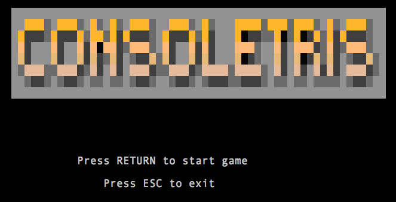
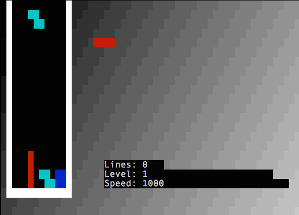

Consoletris
===========

Tetris clone for the ANSI console as example for the programming lectures I teach
at the [Universitat Politècnica de Catalunya](http://www.upc.edu).

How to compile:

	gcc betterconsole.c game.c piece.c pit.c main.c -o consoletris

It uses the "better-console" library: https://github.com/mariomac/better-console
